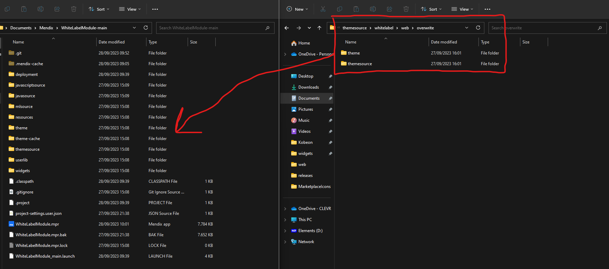

## WhiteLabel Module

Load any whitelabel styling on the fly, you can for example change the primary color whenever you want.

## Features

- Overwrite any sass variables whenever you want
- Functionality to easily setup a custom brand style, allowing you to load a brand based on your own logic.
- Easy to adjust to support any variables you want
- Loads Atlas colors by default

## Installation

!IF YOU HAVE DONE CHANGES TO THE `custom-variables.scss` FILE YOU SHOULD MAKE A BACKUP FIRST SO YOU CAN MERGE IT CORRECTLY AFTER INSTALLATION!

1. Download the module from the appstore
2. In the project settings in the theme tab make sure the module is loaded last
3. Open the project folder and then copy the content from the overwrite folder (should be in themesource/whitelabel/web/overwrite) and paste it inside the root folder of your project, this will overwrite some atlas core files and the custom-variables.scss file. `Do note that any changes you have done to these files will be lost.`

4. Add the `SNIP_BrandOverview` to an admin page where you can manage and test all the different brands you wish to support.

## Usage

Once the installation has succesfully been setup you will have to choose when to load a brand that you have setup. You will have to create some logic yourself to fire the `ACT_Brand_SetVariables` nanoflow with a Brand object at the desired moment. An example: You have a multi-tenant application and one a user logs in you want that user to see the styling of the company that he is a part of. In this case it is wise to add a 1 - 1 association between the `Brand` and `Company` entity. Now once the user logs in you can add a dataview to the layout of the first page that the user will arrive at. This dataview will run a nanoflow which will retrieve the `Brand` from the currentuser's `Company` and then runs the `ACT_Brand_SetVariables` nanoflow. This will then load the desired styles for the user. 

## Adding more variables

By default this module manages the standard `Brand` colors a few `Font` variables and the top and sidebar backgrounds but you can add as many more variables as you wish. This can be especially useful if you have your own design system. You can add more variables by doing the following steps:

1. Add the sass variable to the custom-variables.scss file (if it doesnt exist already). The value of the sass variable should be a css variable (for example `$brand-secondary: var(--brand-secondary);`)
2. Navigate to the `css-variables.scss` file (themesource/whitelabel/web) and add the new css variable to the root (the `--brand-secondary`). Here you can set the value to a default color you wish to use when a brand has not been loaded yet.
3. Add a new string value to the `Brand` entity for the newly added variable.
4. In the `ACT_Brand_SetVariables` nanoflow add another `Javascript Action` activity with action `JS_SetCSSVariable` similar to the other existing actions. Set the Variable name to the newly added css variable (the `--brand-secondary`) and the value should be the newly created string attribute from the `Brand` entity.

## SASS compile errors

It could be that after loading the module your application is giving you styling errors. Something like `Error: $color: var(--brand-primary) is not a color`. This is because we are not using css variables instead of sass variables and there are some sass functions that are not supported for css variables. The main 3 that function that Mendix uses that will give this error are the `lighten`, `darken` and `mix` functions. These can either be replaced with a `color-mix` function or with a new css variable that you will have to load inside the ACT_Brand_SetVariables nanoflow (you can see examples in the overwrite folder from installation step 3).

There are also javascript actions available in the module which can output the correct color values based on the sass `lighten`, `darken` and `mix` functions if you want the perfectly matching color. See the `SUB_Brand_AtlasFixes` nanoflow for an example setup.

## Issues, Suggestions, and Feature Requests

Please feel free to raise any issues, share suggestions, or request new features on the GitHub repository:
[WhiteLabel Module GitHub Issues](https://github.com/hunter-koppen/WhiteLabelModule/issues)